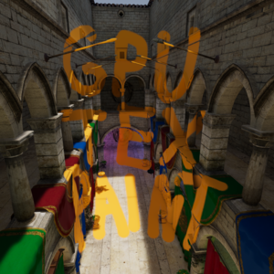
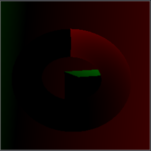
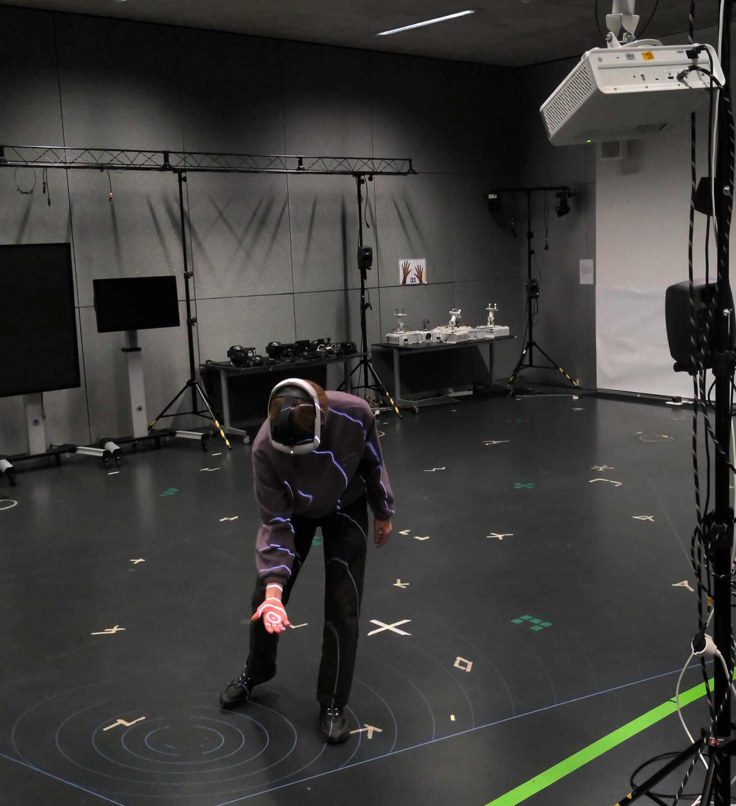
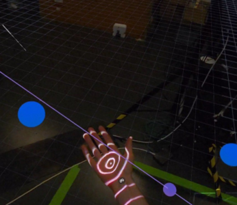
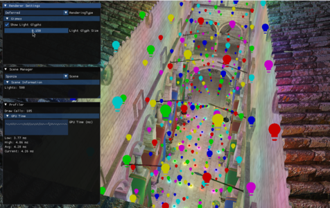
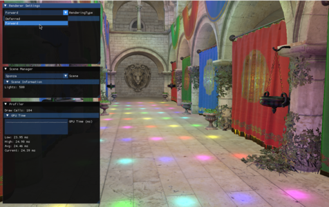
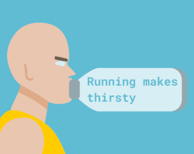

# Hi, I'm Anton Hörig

I became fascinated with the creative possibilities of code early on. During my bachelor's degree in Media Computer Science, I learned a lot about 3D rendering, graphics programming, and their use in artistic contexts from theater stages and museums to video games. This is knowledge I continue to build on and apply in personal projects and experiments.

Key skills: Computer Graphics • C++ • OpenGL • Unity • Unreal • Godot • problem solving • teamwork

# Featured Projects

## [Tool: GPU Texture Painter](https://github.com/maantho/gpu-texture-painter)

    
    
    

A plugin for the Godot-Engine, that allows runtime, scene-wide texture painting on the GPU. 
Achieves an accurate brush/spray effect by painting individual atlas texels. 
Those coordinates are gathered by rendering the scene in a second pass to an offline framebuffer with the UV coordinates as the color. The actual coloring of the atlas is handled by a custom compute shader.
With this technique quality and performance is improved significantly compared to methods utilizing the physics engine.

### My Contribution
I extended Godot's rendering pipeline by using offline framebuffers as data containers and writing compute shaders in GLSL. Creating a tool that uses advanced rendering features while having the usability for artists in mind.

Skills: 3D Rendering • GLSL • Tool Programming • Godot

## [Multi-Projector Calibration & Projection Mapping](https://github.com/maantho/InACTually-Engine)

    <a href="https://github.com/maantho/InACTually-Engine"><video src="media/ProjCalib-Combined.webm" height="150" autoplay loop muted playsinline></video></a>
    
    

Bachelors thesis with the goal to find a projector calibration method, that can be used for dynamic spatial projection mapping in a wide variety of artistic contexts. Out of existing methods a novel multi-projector calibration method was developed to support projection-mapping onto arbitrary dynamic surfaces. This is achieved in a user-friendly way, utilizing a mixed reality headset. It mitigates restriction on the surface and calibration targets, that are common with other projector calibration methods, while being low-cost and adoptable for artists.
It was merged into InACTually.

### My Contribution
I added a specific feature (projector calibration) to an existing project with a large code-base. I utilized my knowledge in linear algebra to calibrate multiple projectors intrinsically and extrinsically in a novel way. I designed it to be accessible to a wide variety of artists. For rendering I used the OpenGL graphics API.

Skills: Computer Graphics • C++ • OpenGL • WebXR 

## [CG Playground](https://github.com/maantho/cg-playground)

    
    

An OpenGL renderer written in C++ designed for experimenting with and learning about rendering techniques. Rendering pipelines are polymorphic and can be swapped out at runtime for better comparison. It currently supports forward and deferred rendering, physically based rendering (PBR) with model loading, debug visualizations, a GUI and a profiler. It has an open architecture and can be extended with advanced rendering techniques.

### My Contribution

I implemented common rendering techniques in an extendable structure. I used modern C++ and paradigms such as RAII. I deepened my understanding of graphics APIs and shaders. 

Skills: real-time rendering • C++ • OpenGL • GLSL

## [Entry to Mini Jame Gam #36](https://github.com/maantho/running-makes-thirsty)

    
    

The theme was "Speedrun" and the special object "Bag". It features a fun mechanic, where the player has to produce enough water to hydrate a marathon runner and chase the highscore by picking and combining fruits, kitchen tools and bottles from the environment.

### My Contribution
I created the art of the game utilizing vector graphics. I designed the game mechanic and implemented it in Godot. The mechanic features the interaction / free combination of different entities with each other. The implementation of the mechanic is abstract and easily extendable to different fruits, food processors and status effects.

Skills: rapid prototyping • problem solving • Godot
